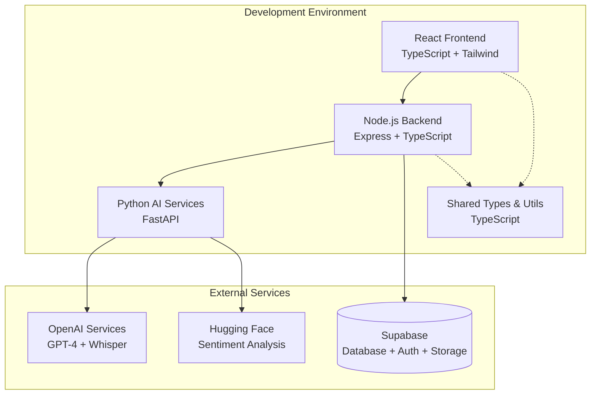

# Design Document

## Overview

The EchoScribe foundation establishes a robust monorepo architecture that supports the development of an AI-driven meeting analyzer. The design follows modern development practices with clear separation of concerns between the React frontend, Node.js API backend, Python AI services, and shared utilities. The architecture is designed for scalability, maintainability, and efficient development workflows.

## Architecture

### High-Level Architecture



### Monorepo Structure

The project follows a clear monorepo structure with dedicated directories for each component:

- **frontend/**: React application with TypeScript and Tailwind CSS
- **backend/**: Node.js Express API with TypeScript
- **ai-services/**: Python FastAPI for AI processing
- **shared/**: Common TypeScript types and utilities
- **supabase/**: Database migrations and configuration
- **scripts/**: Build and deployment automation

## Components and Interfaces

### Frontend Component (React + TypeScript + Tailwind)

**Technology Stack:**
- React 18 with TypeScript for type safety
- Tailwind CSS for utility-first styling
- Vite for fast development and building
- React Router for client-side routing
- Axios for API communication

**Key Configuration:**
- TypeScript strict mode enabled
- Tailwind CSS with custom design system
- ESLint and Prettier for code quality
- Environment variable management for API endpoints

### Backend Component (Node.js + Express + TypeScript)

**Technology Stack:**
- Node.js with Express framework
- TypeScript for type safety
- Supabase client for database operations
- CORS middleware for cross-origin requests
- Express rate limiting for API protection

**Key Configuration:**
- RESTful API design principles
- Middleware for authentication, logging, and error handling
- Environment-based configuration
- Structured logging with Winston

### AI Services Component (Python + FastAPI)

**Technology Stack:**
- Python 3.11+ with FastAPI
- Pydantic for data validation
- OpenAI client for GPT-4 and Whisper
- Transformers library for Hugging Face models
- Async/await for concurrent processing

**Key Configuration:**
- API versioning and documentation
- Async request handling for AI services
- Error handling and retry logic
- Resource management for AI model loading

### Shared Components

**TypeScript Types:**
- Common interfaces for API responses
- Data models for meetings, users, transcriptions
- Utility types for form validation
- Constants for API endpoints and configuration

## Data Models

### Core Data Structures

```typescript
// User model
interface User {
  id: string;
  email: string;
  name: string;
  created_at: string;
  subscription_tier: 'free' | 'pro' | 'enterprise';
}

// Meeting model
interface Meeting {
  id: string;
  title: string;
  description?: string;
  scheduled_at: string;
  duration?: number;
  status: 'scheduled' | 'in_progress' | 'completed';
  participants: string[];
  created_by: string;
  created_at: string;
}

// Transcription model
interface Transcription {
  id: string;
  meeting_id: string;
  content: string;
  confidence_score: number;
  created_at: string;
}
```

### Database Schema (Supabase/PostgreSQL)

```sql
-- Users table (handled by Supabase Auth)
CREATE TABLE profiles (
  id UUID REFERENCES auth.users PRIMARY KEY,
  email TEXT UNIQUE NOT NULL,
  name TEXT NOT NULL,
  subscription_tier TEXT DEFAULT 'free',
  created_at TIMESTAMP WITH TIME ZONE DEFAULT NOW()
);

-- Meetings table
CREATE TABLE meetings (
  id UUID PRIMARY KEY DEFAULT gen_random_uuid(),
  title TEXT NOT NULL,
  description TEXT,
  scheduled_at TIMESTAMP WITH TIME ZONE,
  duration INTEGER,
  status TEXT DEFAULT 'scheduled',
  participants TEXT[],
  created_by UUID REFERENCES profiles(id),
  created_at TIMESTAMP WITH TIME ZONE DEFAULT NOW()
);

-- Transcriptions table
CREATE TABLE transcriptions (
  id UUID PRIMARY KEY DEFAULT gen_random_uuid(),
  meeting_id UUID REFERENCES meetings(id),
  content TEXT NOT NULL,
  confidence_score DECIMAL(3,2),
  created_at TIMESTAMP WITH TIME ZONE DEFAULT NOW()
);
```

## Error Handling

### Frontend Error Handling
- Global error boundary for React components
- API error interceptors with user-friendly messages
- Form validation with real-time feedback
- Loading states and error recovery mechanisms

### Backend Error Handling
- Centralized error middleware for Express
- Structured error responses with consistent format
- Request validation using middleware
- Database error handling with proper HTTP status codes

### AI Services Error Handling
- Retry logic for external AI service calls
- Graceful degradation when AI services are unavailable
- Rate limiting and quota management
- Async error handling with proper logging

## Testing Strategy

### Unit Testing
- **Frontend**: Jest + React Testing Library for component testing
- **Backend**: Jest + Supertest for API endpoint testing
- **AI Services**: Pytest for Python service testing
- **Shared**: Jest for utility function testing

### Integration Testing
- API integration tests using test database
- End-to-end testing with Playwright
- AI service integration tests with mocked responses
- Database migration testing

### Development Workflow
- Pre-commit hooks for linting and testing
- Continuous integration with GitHub Actions
- Automated testing on pull requests
- Code coverage reporting and enforcement

## Development Environment Setup

### Local Development Requirements
- Node.js 18+ for frontend and backend
- Python 3.11+ for AI services
- Docker for Supabase local development
- Git for version control

### Environment Configuration
- Separate .env files for each component
- Environment validation on startup
- Development, staging, and production configurations
- Secure secrets management

### Development Scripts
```json
{
  "scripts": {
    "dev": "concurrently \"npm run dev:frontend\" \"npm run dev:backend\" \"npm run dev:ai\"",
    "dev:frontend": "cd frontend && npm run dev",
    "dev:backend": "cd backend && npm run dev",
    "dev:ai": "cd ai-services && python -m uvicorn main:app --reload",
    "build": "npm run build:frontend && npm run build:backend",
    "test": "npm run test:frontend && npm run test:backend && npm run test:ai",
    "setup": "npm run setup:deps && npm run setup:db",
    "setup:deps": "npm install && cd frontend && npm install && cd ../backend && npm install && cd ../ai-services && pip install -r requirements.txt",
    "setup:db": "npx supabase start && npx supabase db reset"
  }
}
```